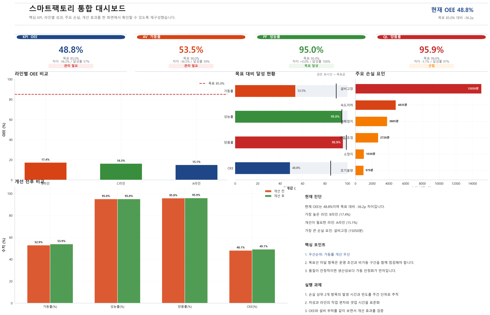
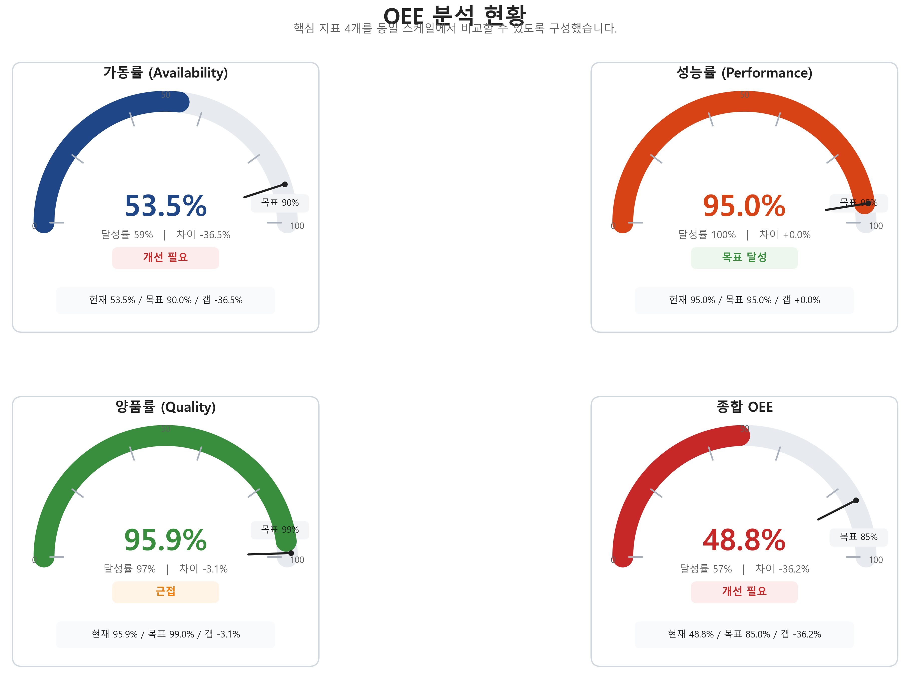
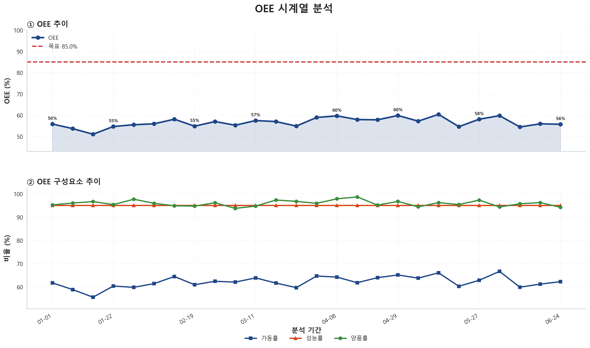
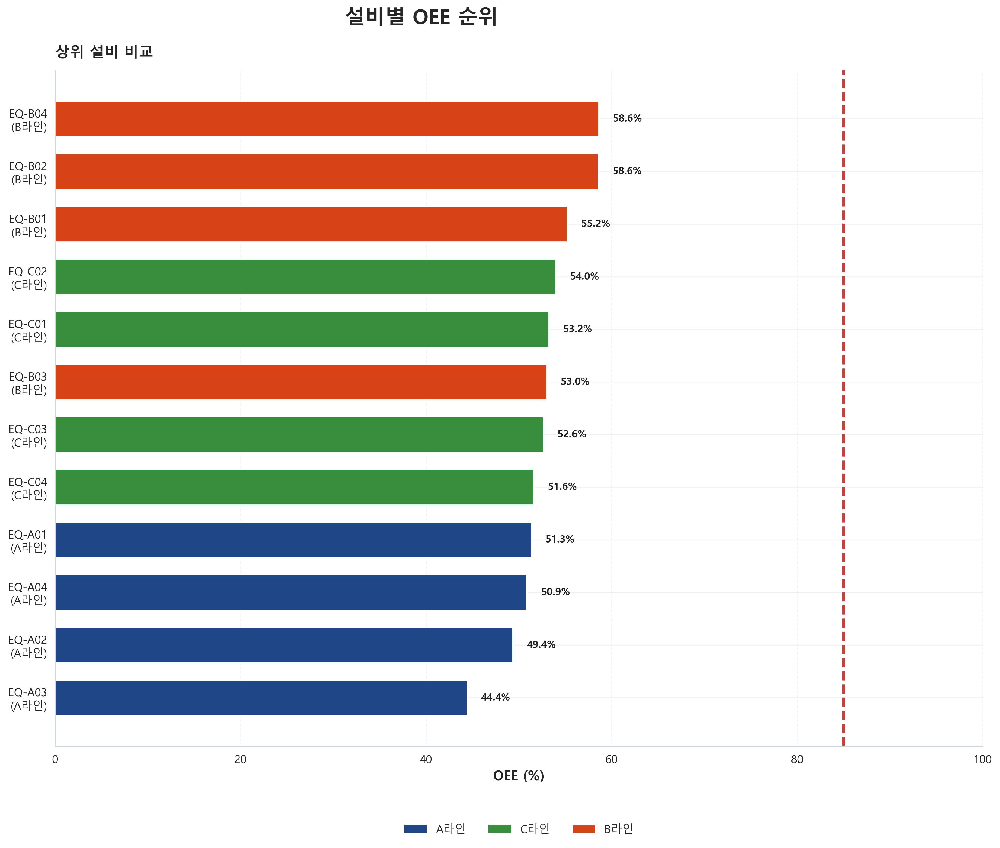
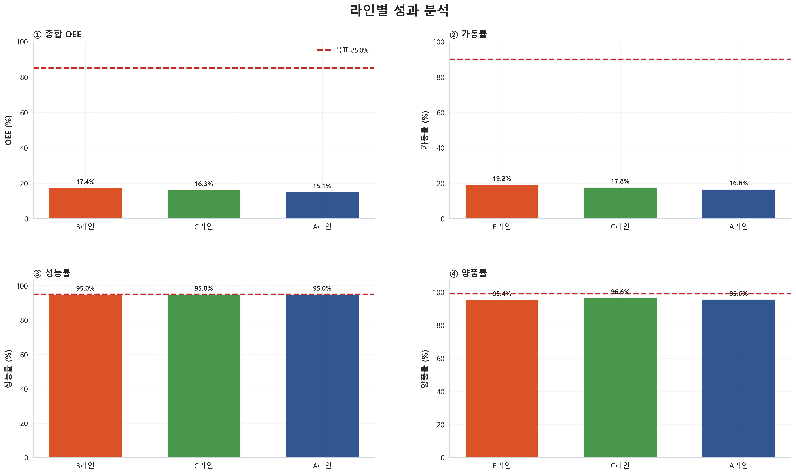
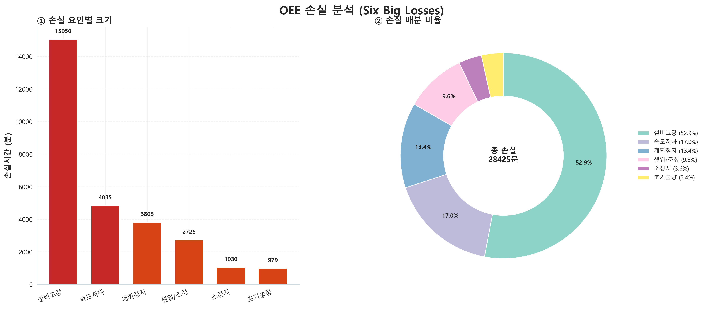
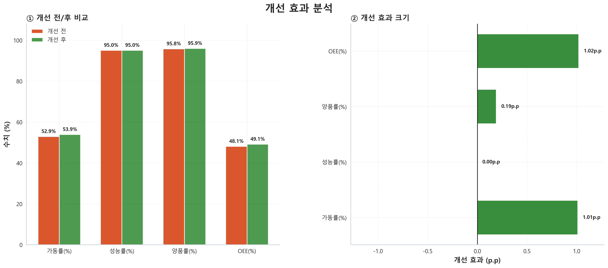

# 🏭 스마트팩토리 통합 데이터 분석 시스템

> **OEE, 품질, 예지보전, 에너지** 4대 분석 모듈 통합 플랫폼

**OEE 분석** → **품질관리** → **예지보전** → **에너지효율** 을 4개 독립 모듈로 분리하여  
각각 최적화된 분석을 수행 후, **통합 대시보드**로 전체 팩토리 상황을 한눈에 파악합니다.

## 🎯 핵심 목표
- ✅ 설비 효율성 극대화 (OEE 85% 이상)
- ✅ 품질 관리 고도화 (Cpk ≥ 1.33)
- ✅ 예기치 않은 고장 예방 (예지보전)
- ✅ 에너지 비용 절감 (원단위 최적화)

---

## 📦 프로젝트 구조

```
integrated_project/
├── data/
│   ├── raw/                    # 원본 데이터
│   │   ├── project1/           # OEE 분석
│   │   ├── project2/           # 품질 분석
│   │   ├── project3/           # 설비 진동/정비
│   │   └── project4/           # 에너지 분석
│   └── processed/              # 분석 결과
│
├── src/                        # 핵심 코드 (~2,500줄)
│   ├── config.py
│   ├── data_loader.py
│   ├── main.py                 # ⭐ 메인 실행 스크립트
│   ├── utils.py
│   ├── analyzers/              # 4개 분석 모듈
│   │   ├── oee_analyzer.py
│   │   ├── quality_analyzer.py
│   │   ├── maintenance_analyzer.py
│   │   └── energy_analyzer.py
│   └── visualizers/
│
├── results/                    # 📊 분석 결과
│   ├── charts/                 # 이미지
│   ├── data/                   # CSV
│   └── reports/                # 마크다운
│
├── requirements.txt
└── docs/
```

---

## 🚀 빠른 시작 (3단계, 5분)

### 1️⃣ 환경 설정
```bash
cd integrated_project
python --version              # 3.8+ 확인
pip install -r requirements.txt
```

### 2️⃣ 데이터 확인
```bash
# 데이터 폴더 구조 확인
ls -la data/raw/

# 신규 데이터 추가 시 (아래 '데이터 추가 방법' 참고)
```

### 3️⃣ 분석 실행
```bash
# Windows
chcp 65001
python src/main.py

# Mac/Linux
python src/main.py
```

**예상 결과**: 1-2분 후 `results/` 폴더에 차트, CSV, 리포트 생성

---

## 📊 분석 결과 샘플

### 통합 대시보드


### OEE 분석 결과
 


---

## � 4대 분석 모듈

| 모듈 | 목표 | 핵심 지표 | 산출물 |
|-----|------|---------|-------|
| **OEE** | 설비 효율 극대화 | OEE, 가동률, 성능, 품질 | 설비별 순위, 라인별 분석 |
| **품질** | 공정 능력 개선 | Cpk, 합격률, 불량 유형 | 파레토 분석, SPC 차트 |
| **정비** | 예기치 않은 고장 예방 | 건강도, 이상 징후, MTBF | 점검 포인트 추천 |
| **에너지** | 비용 절감 | 원단위, 피크 분석 | 절감 기회, ROI |
### 📈 설비 효율 비교


### 📉 라인별 분석


### 🎯 Six Big Losses 분석


### 🔧 개선 효과

### 🔍 각 모듈별 워크플로우

**1️⃣ OEE 분석** (설비 효율)
```
생산 로그 + 설비정보 + 정비기록
    ↓
가동률×성능률×품질률 계산
    ↓
설비별/라인별 순위, 추세 분석
```

**2️⃣ 품질 분석** (공정능력)
```
검사 데이터 + 규격 정보
    ↓
Cpk, 합격률, 불량 유형 분석
    ↓
상위 불량 원인 파레토 분석
```

**3️⃣ 정비 분석** (예지보전)
```
센서 데이터 + 진동/온도 정보
    ↓
이상탐지(Z-score) + 건강도 계산
    ↓
고장 전조 신호, 점검 일정 제안
```

**4️⃣ 에너지 분석** (효율화)
```
전력 소비 데이터 + 생산량
    ↓
시간대별/설비별 비율 분석
    ↓
절감 기회 3가지 도출 (금액 산출)


---

## 🔧 설비 데이터 추가 방법

### 📝 데이터 구조 정의 (각 프로젝트별)

#### **Project 1: OEE 분석**

필수 파일 3개:
```
project1/
├── p1_equipment.csv         # 설비 고유정보
├── p1_production_log.csv    # 생산 기록
└── p1_downtime_log.csv      # 정지/정비 기록
```

**p1_equipment.csv**:
```
equipment_id, equipment_name, line_id, rated_capacity
1, 설비A, 1, 100
2, 설비B, 1, 120
```

**p1_production_log.csv**:
```
timestamp, equipment_id, product_id, quantity, production_time
2024-01-01 09:00, 1, 101, 50, 120 (초 단위)
```

**p1_downtime_log.csv**:
```
date, equipment_id, downtime_reason, duration_minutes, downtime_type
2024-01-01, 1, 부품 교체, 15, 계획정지
```

---

#### **Project 2: 품질 분석**

필수 파일 2개:
```
project2/
├── p2_product_spec.csv      # 제품 규격
└── p2_inspection_log.csv    # 검사 데이터
```

**p2_product_spec.csv**:
```
product_id, parameter, lower_spec, upper_spec, unit
101, 길이, 95, 105, mm
101, 두께, 4.8, 5.2, mm
```

**p2_inspection_log.csv**:
```
timestamp, product_id, parameter, measured_value, result
2024-01-01 10:00, 101, 길이, 100.2, Pass
```

---

#### **Project 3: 정비/예지보전**

필수 파일 3개:
```
project3/
├── p3_equipment.csv         # 설비 정보
├── p3_sensor_log.csv        # 센서 데이터
└── p3_maintenance_log.csv   # 정비 이력
```

**p3_sensor_log.csv**:
```
timestamp, equipment_id, temperature_celsius, vibration_mms, motor_current_amps
2024-01-01 08:00, 1, 65.3, 4.5, 15.2
```

---

#### **Project 4: 에너지 분석**

필수 파일 2개:
```
project4/
├── p4_energy_log.csv        # 전력 소비
└── p4_tariff.csv            # 전기료 정보
```

**p4_energy_log.csv**:
```
timestamp, equipment_id, power_kw, production_quantity
2024-01-01 09:00, 1, 5.2, 100
```

---

### ✅ 데이터 추가 체크리스트

1. **파일 갯수**: 각 프로젝트별 필수 파일 모두 준비 ✓
2. **파일명**: `pX_*.csv` 형식 정확히 ✓
3. **인코딩**: UTF-8 ✓
4. **컬럼명**: 정확한 영문/한글 ✓
5. **데이터 타입**: 
   - 날짜: `YYYY-MM-DD HH:MM:SS`
   - 숫자: `.` (점) 단위
   - 한글: UTF-8 인코딩
6. **결측치**: 모두 제거 또는 적절히 처리 ✓
7. **이상치**: 논리적 범위 내 ✓

---

### 🔄 데이터 추가 후 처리

```python
# 1. config.py에 프로젝트 경로 등록
PROJECT_PATHS = {
    'project1': 'data/raw/project1/',
    'project2': 'data/raw/project2/',
    # ... 신규 추가
}

# 2. data_loader.py 수정 (필요시)
def get_project1_data():
    equipment = pd.read_csv('data/raw/project1/p1_equipment.csv')
    production = pd.read_csv('data/raw/project1/p1_production_log.csv')
    downtime = pd.read_csv('data/raw/project1/p1_downtime_log.csv')
    return {'equipment': equipment, 'production': production, 'downtime': downtime}

# 3. main.py에서 호출
from src.data_loader import DataLoader
loader = DataLoader()
data = loader.get_project1_data()
```

---

## 📋 실행 규칙 & 가이드라인

### 🎯 실행 전 필수 확인

```bash
# 1. 현재 디렉토리 확인
pwd  # /integrated_project 이어야 함

# 2. 데이터 폴더 확인
ls -la data/raw/project1/

# 3. 결과 폴더 확인 (없으면 생성됨)
mkdir -p results/{charts,data,reports}
```

### 💻 실행 환경별 명령어

| OS | 명령어 |
|-----|--------|
| **Windows** | `chcp 65001` → `python src/main.py` |
| **Mac** | `python src/main.py` |
| **Linux** | `python src/main.py` |

### ⚙️ 분석 파라미터 수정

`src/config.py`에서 다음 항목 조정 가능:

```python
# 임계값
QUALITY_CPKTHRESHOLD = 1.33       # Cpk 목표값
MAINTENANCE_HEALTH_THRESHOLD = 70 # 건강도 임계값
ENERGY_TARGET_UNIT = 0.50         # 에너지 원단위 목표

# 파일 경로
OUTPUT_CHART_DIR = 'results/charts/'
OUTPUT_DATA_DIR = 'results/data/'
OUTPUT_REPORT_DIR = 'results/reports/'

# 시각화
FONT_NAME = 'Malgun Gothic'  # Windows: 한글 폰트
DPI = 100                     # 차트 해상도
```

### 🔑 주요 규칙

| 규칙 | 내용 |
|-----|------|
| **데이터 준비** | 모든 필수 CSV 파일 확인 필수 |
| **인코딩** | 모든 파일 UTF-8 |
| **결측치** | 제거 또는 적절한 값으로 채우기 |
| **이상치** | 논리적 범위 확인 필수 |
| **파일명** | `pX_*.csv` 정확히 (공백/특수문자 없음) |
| **컬럼명** | 정확한 영문/한글 |
| **실행 위치** | `/integrated_project` 디렉토리에서만 |
| **결과 저장** | 자동으로 `results/` 생성 |

---

## ❓ 자주 묻는 질문

### Q1. 분석은 몇 분 소요?
**A**: 데이터 크기에 따라 다르지만 보통 1-2분

### Q2. 결과 파일 형식?
**A**: 
- 차트: PNG 이미지
- 데이터: CSV
- 리포트: Markdown

### Q3. 한글이 깨져서 보여요 (Windows)
**A**: 터미널에서 `chcp 65001` 실행 후 재시도

### Q4. 특정 설비만 분석하려면?
**A**: `src/config.py`에서 필터링 조건 수정 후 재실행

### Q5. 내 데이터를 추가하려면?
**A**: 위의 "설비 데이터 추가 방법" 참고

### Q6. 자동 스케줄 설정?
**A**: 
```bash
# 매일 21시에 실행 (Linux/Mac)
0 21 * * * cd /path/to/integrated_project && python src/main.py
```

---

## 🛠️ 기술 스택

```
Language: Python 3.8+

Core Libraries:
├─ pandas       (데이터 처리)
├─ numpy        (수치 계산)
├─ scipy        (통계 분석)
└─ matplotlib   (시각화)

Data Format:
├─ CSV (로딩)
├─ PNG (차트 저장)
└─ Markdown (리포트)
```

---

## 📚 학습 자료

```
lectures/           (15개 강의 노트북)
├─ 기초: 변수, 자료형, 자료구조, 함수
├─ 분석: numpy, pandas, 집계, 병합
└─ 시각화: matplotlib, seaborn

실습/               (9개 실습 노트북)
├─ 기초: pandas, 전처리, 집계
└─ 프로젝트: OEE, 품질, 정비, 에너지
```

---

## 📊 프로젝트 통계

| 항목 | 수치 |
|-----|------|
| 총 코드 라인 | ~2,500줄 |
| 분석 모듈 | 4개 |
| 차트 종류 | 8+ |
| 설정 항목 | 50+ |
| 분석 시간 | 1-2분 |
| 학습 시간 | 40-60시간 |

---

## ✅ 체크리스트

```
준비 단계:
☐ Python 3.8+ 설치
☐ integrated_project/ 폴더 확인
☐ pip install -r requirements.txt 완료

데이터:
☐ data/raw/project1~4 폴더 확인
☐ 각 폴더에 필수 CSV 파일 있는지 확인
☐ 데이터 인코딩 UTF-8

실행:
☐ cd integrated_project
☐ python src/main.py 실행
☐ results/ 폴더에 파일 생성 확인
```

---

## 🎯 다음 단계

- [ ] 정기 스케줄 실행 설정 (cron job)
- [ ] 실시간 대시보드 구축 (Streamlit)
- [ ] 머신러닝 모델 추가 (이상탐지)
- [ ] 웹 배포 (Flask)
- [ ] 클라우드 이전 (AWS/Azure)

---

**최종 업데이트**: 2026년 4월 8일  
**상태**: ✅ 운영 중


